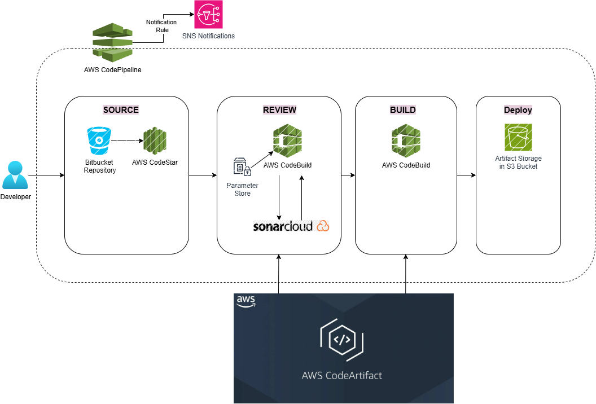

# 🚀 vProfile Multitier Java Stack: AWS Native Automated CI Pipeline

This repository contains the complete **AWS Native CI Pipeline** for the vProfile Java application. The project demonstrates a production-grade DevOps workflow, ensuring every code push is automatically built, analyzed, and stored using managed cloud services.

---

## 🏗 System Architecture

The infrastructure utilizes **AWS Native Services** to ensure security, scalability, and real-time monitoring of the build lifecycle.
* **AWS CodePipeline:** Orchestrates the workflow stages.
* **AWS CodeStar Connections:** Provides secure, credential-less integration with **Bitbucket**.
* **AWS CodeBuild:** Serverless environment for Maven builds and SonarCloud analysis.
* **AWS CodeArtifact:** Managed artifact repository for secure dependency management.
* **Amazon S3:** Centralized storage for versioned production artifacts.
* **AWS SNS:** Real-time email notifications for pipeline state changes (Success/Failure).
* **SonarCloud:** SaaS-based quality gate enforcement.




**Pipeline Validation:** Screenshots of successful execution stages are documented in the `/diagrams` folder.

---

## 📂 Project Structure

```text
vprofile-ci-aws-automation/
├── src/                    # Java source code (Spring Boot)
├── aws-files/              # Infrastructure & Configuration files
│   ├── ssh_config_file     # SSH config for secure Bitbucket communication
│   └── build_buildspec.yml # Specialized build instructions for CodeBuild
├── buildspec.yml           # Main SonarCloud analysis & Build spec
├── pom.xml                 # Maven Project Configuration
├── settings.xml            # AWS CodeArtifact authentication settings
└── README.md               # Project documentation
```
## 🚀 Pipeline Workflow
* **Source**: Triggered by Bitbucket via AWS CodeStar Connections. 

* **Review**: CodeBuild retrieves Sonar tokens from SSM Parameter Store and runs static analysis.

* **Quality Gate**: SonarCloud validates the code against security and quality standards.

* **Build**: Static analysis performed by SonarCloud for security and bugs.

* **Artifact Storage**: Automated check to ensure code meets organizational standards.

* **Notification**: Versioned .war files are securely pushed to Amazon S3.


## 🛠 Project Roadmap (Steps Taken)
### Phase 1: Managed Infrastructure Setup
* **AWS Environment**: Configured IAM Service Roles with Least Privilege policies for CodeBuild and S3.

* **Artifact Management**: Created AWS CodeArtifact domains and repositories to replace self-managed Nexus.

* **Storage**: Provisioned S3 buckets with versioning enabled for artifact lifecycle management.

### Phase 2: Pipeline Development
* **Secure Auth**: Configured settings.xml and SSH identity files for encrypted communication with Bitbucket and CodeArtifact.

* **Quality Integration**: Leveraged AWS SSM Parameter Store to securely inject SonarCloud tokens during the build.

* **Build Optimization**: Refactored buildspec.yml to handle both Maven compilation and Sonar scanner execution.


## 💻 Tech Stack
**Cloud**: AWS (CodePipeline, CodeBuild, CodeArtifact, S3, SSM, IAM)

**Build Tool**: Maven

**Quality Gate**: SonarCloud

**SCM**: Bitbucket (Production), GitHub (Documentation)

**Runtime**: Java 17 (Amazon Corretto)

---

### 👥 Credits & Acknowledgments
* Application Source: Originally provided by the hkhcoder for educational purposes.

* DevOps & Cloud Infrastructure: Designed and implemented by Salma Easa. This includes the full migration to AWS Native services and security hardening.